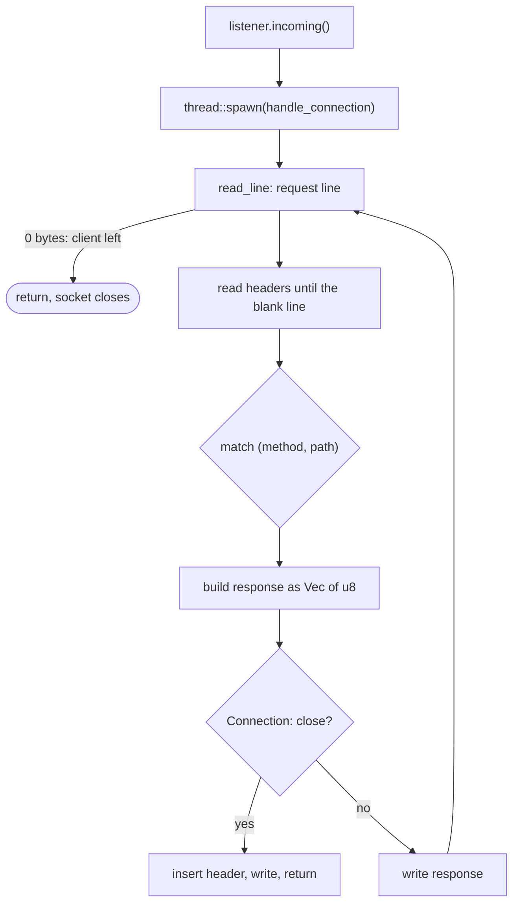
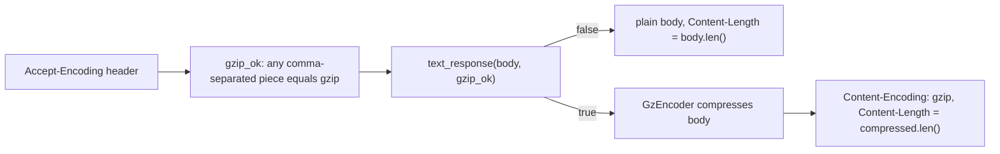

# codecrafters-http-server-rust

A small HTTP/1.1 server in Rust, written by working through CodeCrafters' "Build your own HTTP server" stages. I checked it against CodeCrafters' open-source tester running on my own machine, so none of this needed a membership.

It serves:

| Request | Response |
|---|---|
| `GET /` | `200`, empty body |
| `GET /echo/{str}` | `200`, `str` as a `text/plain` body. Gzip-compressed if the client lists `gzip` in `Accept-Encoding` |
| `GET /user-agent` | `200`, the request's `User-Agent` value as the body |
| `GET /files/{name}` | `200` with the file's raw bytes (`application/octet-stream`), or `404` |
| `POST /files/{name}` | writes the request body to `{directory}/{name}`, replies `201` |
| anything else | `404` |

Connections stay open between requests until the client sends `Connection: close` or disconnects. Each connection gets its own thread.

## Run it

```bash
cargo build --release
mkdir -p /tmp/files
./your_server.sh --directory /tmp/files/
```

`--directory` is only used by the `/files` routes. `your_server.sh` builds into `/tmp/codecrafters-build-http-server-rust` and runs the binary from there, so the `name` in `Cargo.toml` has to stay `codecrafters-http-server`.

Try it from another terminal:

```bash
curl -i localhost:4221/echo/abc
curl -i -H "User-Agent: foobar/1.2.3" localhost:4221/user-agent
curl -i --data "12345" -H "Content-Type: application/octet-stream" localhost:4221/files/file_123
curl -s -H "Accept-Encoding: gzip" localhost:4221/echo/pineapple | gzip -d
curl --http1.1 -v localhost:4221/echo/orange --next localhost:4221/ -H "Connection: close"
```

The last one sends two requests on one connection; curl prints `Re-using existing connection` for the second.

## How the code works

Everything is in `src/main.rs`. `main` binds port 4221, reads `--directory`, and spawns a thread per connection. `handle_connection` does the rest:



Some decisions worth knowing about:

- **One `BufReader` per connection, created outside the loop.** It may have already pulled the start of the next request off the socket. A fresh reader per request would drop those bytes. The reader works on `stream.try_clone()` so the original `stream` stays free for writing.
- **Headers are read with `read_line`, not `.lines()`.** After the blank line the reader sits exactly at the first byte of the body, so `POST` can call `read_exact(content_length)` on the same reader.
- **Header variables live inside the request loop.** Otherwise request 2 would inherit request 1's `User-Agent` and `Content-Length`.
- **Every response is a `Vec<u8>`.** Headers are text, but file contents and gzip output are binary, so nothing goes through a `String` once it holds a body.
- **`safe_path` rejects names containing `..` or `/`,** so `/files/../../etc/passwd` can't leave the directory.

### Gzip



`encoder.finish()` matters: without it the gzip trailer is never written and the client reports `unexpected EOF`. `Content-Length` has to be the compressed size, and the compressed bytes are appended after the headers with `extend_from_slice` because they aren't valid UTF-8.

Only `/echo` is compressed. `/user-agent` always passes `false`.

## Testing with CodeCrafters' tester, locally

CodeCrafters' hosted test runner needs a paid membership, but the tester itself is open source (`codecrafters-io/http-server-tester`). This is how I used it.

**1. Build the tester.** It's a Go program.

```bash
cd ~/Documents/projects/DevOps_Docker/http-server-tester/
make build          # produces dist/main.out
```

**2. Make the project look like a CodeCrafters repo.** The tester launches `your_server.sh` and reads `codecrafters.yml`, both in the Rust project's root:

```yaml
debug: true
```

**3. Find the stage slugs.** Each stage is identified by a short slug defined in the tester's source:

```bash
grep -rn "Slug" internal/ | head -30     # internal/tester_definition.go
```

**4. Wrap the environment variables in a script.** The tester needs the project path and a JSON list of stages to run. `export` only lasts for one terminal session, and the JSON changes as stages get added, so a script in the tester folder beats editing `~/.zshrc`:

```bash
#!/bin/sh
export CODECRAFTERS_REPOSITORY_DIR=/home/barmanji/Documents/projects/Rust/codecrafters-http-server-rust/
export CODECRAFTERS_SUBMISSION_DIR="$CODECRAFTERS_REPOSITORY_DIR"

export CODECRAFTERS_TEST_CASES_JSON='[
  {"slug":"at4","tester_log_prefix":"stage-1","title":"Stage #1: Bind to a port"},
  {"slug":"ia4","tester_log_prefix":"stage-2","title":"Stage #2: Respond with 200"},
  {"slug":"ih0","tester_log_prefix":"stage-3","title":"Stage #3: Extract URL path"},
  {"slug":"cn2","tester_log_prefix":"stage-4","title":"Stage #4: Respond with body"},
  {"slug":"fs3","tester_log_prefix":"stage-5","title":"Stage #5: Read header"},
  {"slug":"ej5","tester_log_prefix":"stage-6","title":"Stage #6: Concurrent connections"},
  {"slug":"ap6","tester_log_prefix":"stage-7","title":"Stage #7: Return a file"},
  {"slug":"qv8","tester_log_prefix":"stage-8","title":"Stage #8: Read request body"},
  {"slug":"df4","tester_log_prefix":"stage-9","title":"Stage #9: Compression headers"},
  {"slug":"ij8","tester_log_prefix":"stage-10","title":"Stage #10: Multiple compression schemes"},
  {"slug":"cr8","tester_log_prefix":"stage-11","title":"Stage #11: Gzip compression"},
  {"slug":"ag9","tester_log_prefix":"stage-12","title":"Stage #12: Persistent connections"},
  {"slug":"ul1","tester_log_prefix":"stage-13","title":"Stage #13: Concurrent persistent connections"},
  {"slug":"kh7","tester_log_prefix":"stage-14","title":"Stage #14: Connection closure"}
]'

cd "$(dirname "$0")" && ./dist/main.out
```

The tester only runs the stages in that array and stops at the first failure. While working on one stage I keep only its line in the array, then put the full list back to catch regressions. The JSON has to stay valid: a comma between objects, none after the last.

**5. Run it.**

```bash
chmod +x run_tests.sh
./run_tests.sh
```

The tester starts the server itself (passing `--directory` for the file stages), sends the requests, and prints what it sent, what came back, and what it expected.

## The stages

| Stage | Slug | What it needed |
|---|---|---|
| 1. Bind to a port | `at4` | `TcpListener::bind("127.0.0.1:4221")` |
| 2. Respond with 200 | `ia4` | write `HTTP/1.1 200 OK\r\n\r\n` |
| 3. Extract URL path | `ih0` | second word of the request line, `200` for `/`, else `404` |
| 4. Respond with body | `cn2` | `/echo/{str}` with `Content-Type` and `Content-Length` |
| 5. Read header | `fs3` | loop over header lines, `split_once(':')`, `trim()`, case-insensitive name match |
| 6. Concurrent connections | `ej5` | `thread::spawn` per connection |
| 7. Return a file | `ap6` | `--directory` flag, `fs::read`, `404` if missing |
| 8. Read request body | `qv8` | `Content-Length`, `read_exact` on the same `BufReader`, `fs::write`, `201` |
| 9. Compression headers | `df4` | read `Accept-Encoding`, add `Content-Encoding: gzip` only when asked |
| 10. Multiple compression schemes | `ij8` | already handled by splitting on `,` in stage 9 |
| 11. Gzip compression | `cr8` | `flate2`, compressed body, `Content-Length` of the compressed bytes |
| 12. Persistent connections | `ag9` | wrap the request cycle in a `loop` |
| 13. Concurrent persistent connections | `ul1` | already handled: one thread plus one loop per connection |
| 14. Connection closure | `kh7` | `Connection: close` in the request ends the loop and is echoed in the response |

Run `./run_tests.sh` to see where the current code stands.


## Known limits

- One thread per connection, with no cap and no idle timeout. A client that connects and goes quiet holds a thread until it disconnects.
- `Connection: close` is inserted into the response by splicing bytes after the status line. It works for every response this server produces, but it's a patch, not a proper header builder.
- Compression uses `unwrap()`, so a failure there kills that connection's thread (not the server).
- Requests are parsed leniently: no HTTP version check, no limit on header size, and `Content-Length` that fails to parse is treated as `0`.
- Request targets are only handled in origin form (`/path`).
